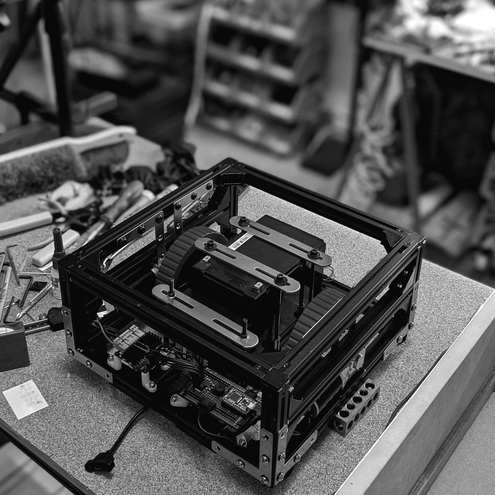

# README

> [!WARNING]  
> _No documentation effort has been made as this is a (supporting) art project for artist [James Langdon](https://www.instagram.com/jameslangdon.eu/) curated by the lovely [l-o-o-m space Berlin](https://www.l-o-o-m.com/chapter/12)_
>
>_Since it was an engineering support for an art project, it indirectly, intentionally and un-intentionally becomes and quasi art project - hence suffering is a must for; hence no documentation of codebase but rather this irrelevant text_ 🥸

__📸 courtesy__: l-o-om

---

## LICENSE

[unlicense](LICENSE)
